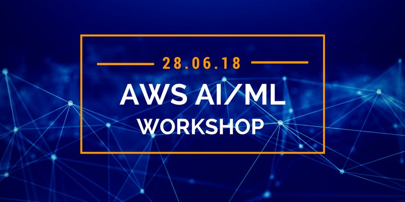

# AI/ML Workshops 
### 28 June 2018

Welcome to the AI/ML workshops. Today we are going to take a look at several AI/ML offerings from AWS that you can use to build and train models or easily intergrate AI/ML features into your applications.

Below you'll find todays Agenda and links to the labs that we will be using today.

## Agenda

| Time | Session | Workshop Title |
|---|:---:|:---|
| 9.30 AM - 11.00 AM | 1 | [Building Chat Bots with Lex - My Personal Banker (Python)](https://github.com/spturner/AI_ML_Workshops/tree/master/lab-1-Building_Chat_Bots_With_Lex) |
|  |  | [Building Chat Bots with Lex - CoffeeBot (NodeJS)](https://github.com/adamrb/amazon-ai-building-better-bots) |
| 11:15 AM - 12:45 PM | 2 | [A hands-on look at the Amazon Rekognition API](https://github.com/spturner/AI_ML_Workshops/tree/master/lab-2-Hands_on_with_Rekognition_API) |
| 1:15 PM - 2:45 PM | 3 | [Introduction to Amazon Machine Learning](https://github.com/spturner/AI_ML_Workshops/tree/master/lab-3-Intro_to_Amazon_ML) |
| 3:00 PM - 4:30 PM	| 4 | [Getting started with Sagemaker](https://github.com/awslabs/amazon-sagemaker-workshop/tree/master/Introduction) |

## Feedback

Please remember to fill in your survey following today's workshop

